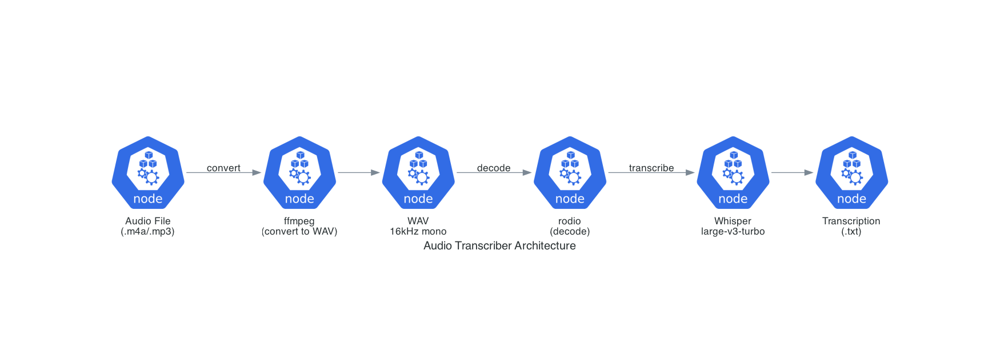

# Audio Transcriber

Local audio transcription using Whisper. Supports Chinese and English.

## Architecture



## How It Works

This tool uses [Kalosm](https://github.com/floneum/floneum), a Rust library for local AI inference, to run OpenAI's Whisper speech recognition model entirely on your machine.

**Key components:**
- **Whisper model**: `whisper-large-v3-turbo` - OpenAI's multilingual speech recognition model (~3GB), selected in `src/main.rs` via `WhisperSource::large_v3_turbo()`
- **Kalosm**: Rust wrapper that downloads and runs the model locally using the [Candle](https://github.com/huggingface/candle) ML framework
- **rodio**: Audio decoding library for reading WAV files

**Flow:**
1. Load Whisper model (automatically downloaded from [HuggingFace](https://huggingface.co/openai/whisper-large-v3-turbo) to `~/.cache/huggingface/` on first run, ~3GB)
2. Decode audio file to raw samples
3. Stream audio through Whisper, outputting text chunks in real-time
4. Save complete transcription to file

## Prerequisites

1. **Rust**
   ```bash
   curl --proto '=https' --tlsv1.2 -sSf https://sh.rustup.rs | sh
   source ~/.cargo/env
   ```

2. **ffmpeg**
   ```bash
   # macOS
   brew install ffmpeg
   
   # Ubuntu/Debian
   sudo apt install ffmpeg
   ```

## Installation

```bash
git clone https://github.com/LAYTAT/audio-transcriber.git
cd audio-transcriber
cargo build --release
```

## Usage

```bash
# Convert audio to WAV first (required format)
ffmpeg -i audio.m4a -ar 16000 -ac 1 audio.wav

# Transcribe Chinese
cargo run --release -- audio.wav zh

# Transcribe English
cargo run --release -- audio.wav en
```

## Output

- Prints transcription to console in real-time
- Saves to `<filename>_transcription.txt`

## Changing the Model

Edit `src/main.rs` line 18 to use a different Whisper variant:

```rust
// Options:
WhisperSource::tiny_en()      // English only, fastest, ~75MB
WhisperSource::base_en()      // English only, ~140MB
WhisperSource::small_en()     // English only, ~460MB
WhisperSource::large_v3()     // Multilingual, ~3GB
WhisperSource::large_v3_turbo() // Multilingual, faster, ~3GB (default)
```

## Performance

| Audio Length | Transcription Time | Hardware |
|--------------|-------------------|----------|
| 75 min | ~30 min | Apple M4 (CPU) |

*Speed varies by hardware. GPU acceleration available with CUDA.*
